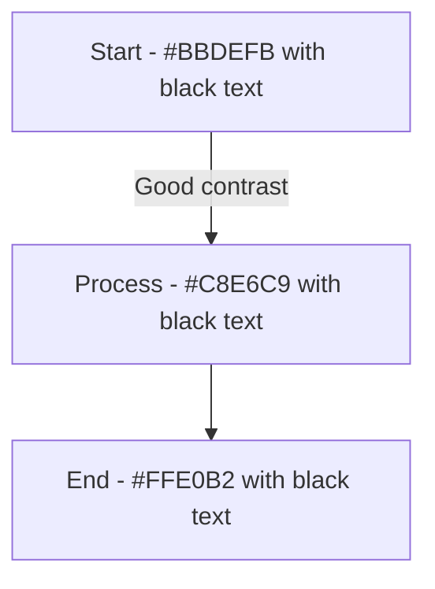

# CLAUDE.md - Project-Specific Instructions for Claude

## Python Environment Activation Rule
```bash
# Setup python env in .venv
./setup.sh
```

**IMPORTANT**: Always activate the local virtual environment before running any Python scripts or commands:

```bash
source .venv/bin/activate
```

## CLI Usage Rule

All Python functionality must go through our CLI interface. Do not EVER run Python scripts directly. Use the `cli` command instead:

```bash
# Good - using the CLI
cli proj -s                  # Show repository size
cli dev -a                   # Run all checks

# Bad - running Python directly
python some_script.py  # Don't do this! (Unless one-off, debugging)
```

## Available CLI Commands

- `cli proj` - Project information and statistics
- `cli dev` - Development tools (lint, format, type check)
- `cli --help` - Show all available commands

## Development Guidelines

1. The CLI follows modular architecture with subcommands
2. Each command group lives in its own module under `commands/subs/`
3. All code must pass black formatting, ruff linting, and mypy type checking
4. Pre-commit hooks enforce code quality standards

## Clean Architecture Principles

**ALWAYS follow these architectural principles:**

### 1. Separation of Concerns
- Each module should have ONE clear responsibility
- Don't mix business logic with presentation logic
- Keep command parsing separate from command execution

### 2. Layered Architecture
```
CLI Layer (main.py)
    ↓
Command Layer (commands/*.py)
    ↓
Business Logic Layer
    ↓
External Services/Tools
```

### 3. Before Creating New Files
**STOP and ask:**
1. Does this functionality belong in an existing module?
2. Can I extend an existing class instead of creating a new one?
3. Is this following the established patterns?

Example:
```python
# Before creating commands/new_feature.py, consider:
# - Could this be a new method in proj.py?
# - Is it truly a separate concern?
# - Does it warrant its own command group?
```

### 4. Design Right First Time
- Think about the interface before implementation
- Consider future extensibility
- Write code that's easy to delete, not easy to extend
- Prefer composition over inheritance

## Git Safety Rules

**NEVER run these commands without explicit user confirmation:**

```bash
# Dangerous commands - ALWAYS ask first:
git reset --hard
git push --force
git clean -xdf
git checkout .  # (when it would discard changes)
rm -rf
```

**ALWAYS ask before:**
- Creating any git commit
- Pushing to remote
- Any destructive git operation
- Modifying git history

Example interaction:
```
Claude: "I've made the changes. Should I create a commit with the message 'Add type annotations to all modules'?"
User: "Yes, go ahead"
Claude: *only then runs git commit*
```

## Python Type Annotations Rule

**ALWAYS use type annotations in all Python code**. This project enforces strict typing with mypy.

```python
# Good - with type annotations
def process_data(input_file: Path, max_size: int = 100) -> Dict[str, Any]:
    results: List[str] = []
    ...

# Bad - missing type annotations
def process_data(input_file, max_size=100):  # Don't do this!
    results = []
    ...
```

Every function, method, and variable should have proper type hints. This includes:
- Function parameters and return types
- Class attributes
- Variable annotations where type inference isn't clear
- Using `from typing import ...` for complex types

## Project Structure

- `commands/` - Python CLI implementation
  - `commands/` - Subcommand modules
  - `main.py` - CLI entry point
- `setup.sh` - Sets up Python environment and CLI
- `pyproject.toml` - Project configuration and tool settings

## Visual Accessibility Guidclines for Mermaid Diagrams

When creating Mermaid diagrams, graphs, or charts, ALWAYS ensure:

1. **High contrast** between background and text (WCAG AA minimum 4.5:1)
2. **Avoid problematic color combinations**:

   - Never use red/green together (colorblind unfriendly)
   - No light colors on white backgrounds
   - No dark colors on black backgrounds

3. **Use these accessible color schemes**:

   - Success/Done: `#2E7D32` (dark green) on white or `#C8E6C9` (light green) with black text
   - Warning/In Progress: `#F57C00` (dark orange) on white or `#FFE0B2` (light orange) with black text
   - Error/Todo: `#C62828` (dark red) on white or `#FFCDD2` (light red) with black text
   - Info: `#1565C0` (dark blue) on white or `#BBDEFB` (light blue) with black text

4. **Include text labels** in addition to colors
5. **Use patterns or icons** as secondary indicators when possible

Example for Mermaid:


