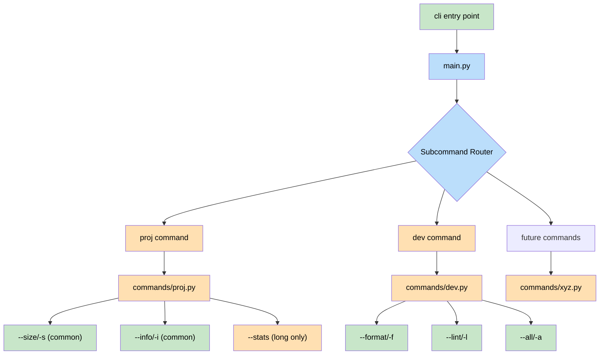
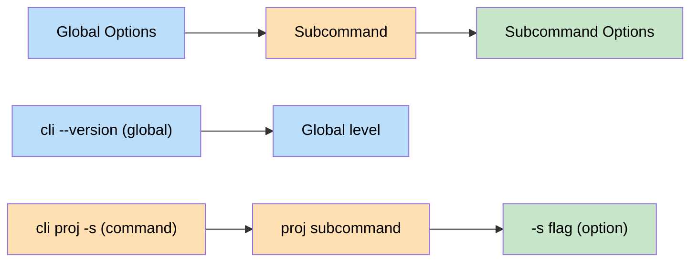
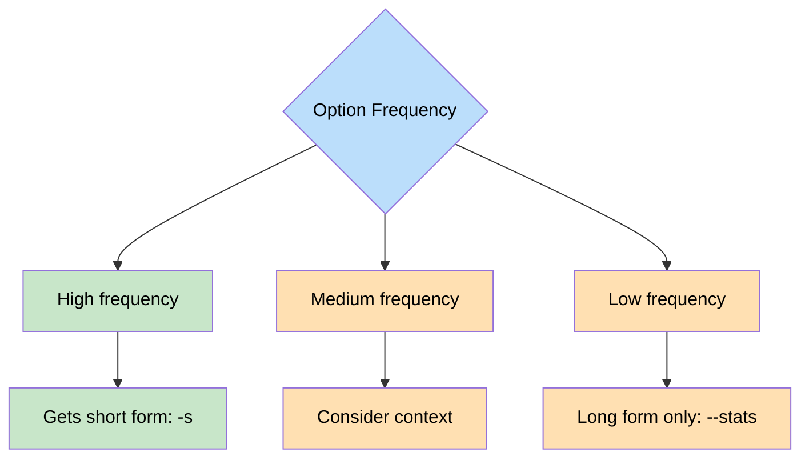

# CLI Architecture & Design Principles

A well-designed command-line interface for the Shaypoor project, demonstrating best practices in CLI development.

## Architecture Overview



## Core Design Principles

### 1. Separation of Concerns
Each subcommand lives in its own module under `commands/`. This ensures:
- **Modularity**: Easy to add/remove features
- **Maintainability**: Changes to one command don't affect others
- **Testability**: Each command can be tested in isolation

```
commandline/
├── __init__.py
├── main.py              # Entry point & router
└── commands/
    ├── __init__.py
    ├── proj.py          # Project-related commands
    ├── dev.py           # Development tools
    └── future.py        # Future commands...
```

### 2. Option Design Philosophy

#### Short vs Long Options
- **Short options (`-s`)**: Reserved for the most frequently used operations
- **Long options (`--stats`)**: Used when short option conflicts exist

```bash
# Example: Within 'proj' subcommand
-s, --size     # Gets short form (most common)
-i, --info     # Gets short form (common)
--stats        # Long form only (-s already taken)
```

#### Minimal Positional Arguments
We avoid positional arguments to maximize flexibility:

```bash
# Good - Easy to combine
cli proj -s -i
cli proj --stats -s

# Bad - Positional args limit combinations
cli proj size info  # How to add flags?
```

### 3. Subcommand Pattern



## Usage Examples

```bash
# Show help
cli --help              # Main help
cli proj --help         # Subcommand help

# Project information
cli proj -s             # Repository size
cli proj -i             # Git information
cli proj --stats        # Detailed statistics

# Development tools
cli dev -f              # Format code
cli dev -l              # Lint code
cli dev -a              # Run all checks

# Combinations work naturally
cli proj -s -i          # Size and info together
```

## Adding New Commands

### 1. Create new module in `commands/`:
```python
# commands/newcmd.py
class NewCommands:
    def __init__(self, project_root: Path):
        self.project_root = project_root
    
    @staticmethod
    def add_subparser(subparsers):
        parser = subparsers.add_parser('newcmd', help='...')
        parser.add_argument('-x', '--example', ...)
        return parser
```

### 2. Register in `main.py`:
```python
from .commands.newcmd import NewCommands

# In main():
NewCommands.add_subparser(subparsers)
```

## Best Practices

### ✅ DO:
- Use flags for all options (no positional args)
- Reserve short options for common operations
- Group related functionality in subcommands
- Provide helpful descriptions in `help` strings

### ❌ DON'T:
- Mix unrelated features in one subcommand
- Use positional arguments for options
- Assume short options are always available
- Create deeply nested subcommands

## Option Conflict Resolution

When short options conflict within a subcommand:



The most frequently used option wins the short form. This follows Unix tradition where `-v` typically means version (not verbose) because it's used more often.

## Future Extensibility

The architecture supports easy addition of new commands without touching existing code:

```bash
cli proj --size          # Project management
cli build --release      # Future: Build commands
cli test --coverage      # Future: Test commands
cli deploy --staging     # Future: Deployment
```

Each command maintains its own option namespace, preventing conflicts and maintaining clarity.